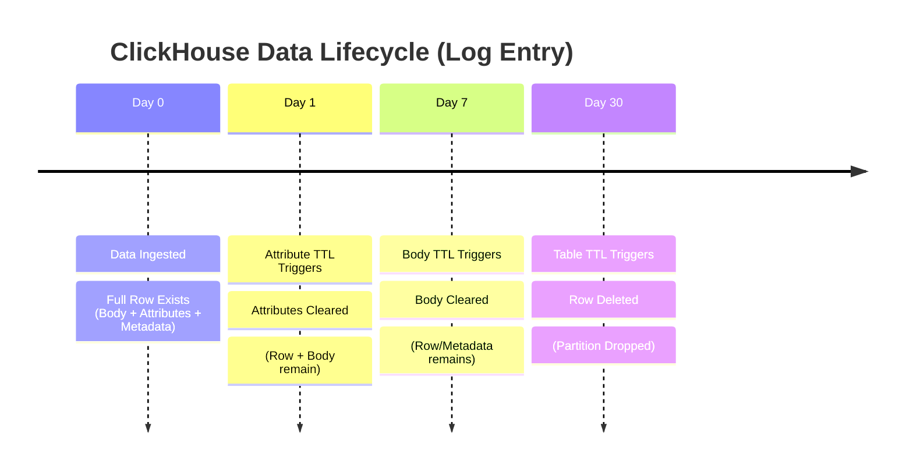

This note covers the hierarchical configuration of Time-To-Live (TTL) settings in ClickHouse, allowing for different expiration schedules for the table rows versus heavy specific columns.

## ClickHouse TTL Configuration Levels

**Question:** How can you configure different data retention periods for specific columns (e.g., heavy logs) versus the entire table row in ClickHouse?

**Answer Principle:** You can layer TTL configurations by setting a **Table Level TTL** to drop entire parts (rows) after a long retention period (e.g., 30 days) and a **Column Level TTL** to reset specific column values to their default state after a shorter period (e.g., 1 or 7 days).

**Explanation:**
In high-volume logging environments (like ClickStack), it is often efficient to keep metadata for a long time but discard heavy payloads (like the raw log body or extensive attributes) sooner to save disk space. ClickHouse allows `TTL` expressions to be applied to both the table and individual columns.

1. Table Level TTL (Row Expiration)

    This is the master switch. When this TTL triggers, the entire row (or partition) is removed.

    * **Goal:** Keep the log entry existence for 30 days.
    * **Mechanism:** Drop parts that belong to the partition after the interval.

    ```sql
    /* Expire entire rows after 30 days */
    ALTER TABLE otel_logs MODIFY TTL TimestampTime + toIntervalDay(30);
    ```

2. Column Level TTL (Data Pruning)

    This allows the row to persist, but "heavy" columns are cleared (reset to default values) to save space.

    * **Goal:** Remove the raw Body after 7 days, but keep the row searchable by other tags.
    * **Mechanism:** Reset the column values to their default state after the interval.

    ```sql
    /* Expire Body text after 7 days */
    ALTER TABLE otel_logs MODIFY COLUMN Body String CODEC(LZ4) TTL Timestamp + INTERVAL 7 DAY;

    /* Expire Attributes maps after 1 day */
    ALTER TABLE otel_logs MODIFY COLUMN LogAttributes Map(LowCardinality(String), String) CODEC(LZ4) TTL Timestamp + INTERVAL 1 DAY;
    ALTER TABLE otel_logs MODIFY COLUMN ResourceAttributes Map(LowCardinality(String), String) CODEC(LZ4) TTL Timestamp + INTERVAL 1 DAY;
    ALTER TABLE otel_logs MODIFY COLUMN ScopeAttributes Map(LowCardinality(String), String) CODEC(LZ4) TTL Timestamp + INTERVAL 1 DAY;
    ```

### Visualization of Data Lifecycle

The following diagram illustrates how the data footprint shrinks over time as different TTLs trigger:



**References:**

* [ClickHouse Documentation: TTL](https://clickhouse.com/docs/en/engines/table-engines/mergetree-family/mergetree#table_engine-mergetree-ttl)
